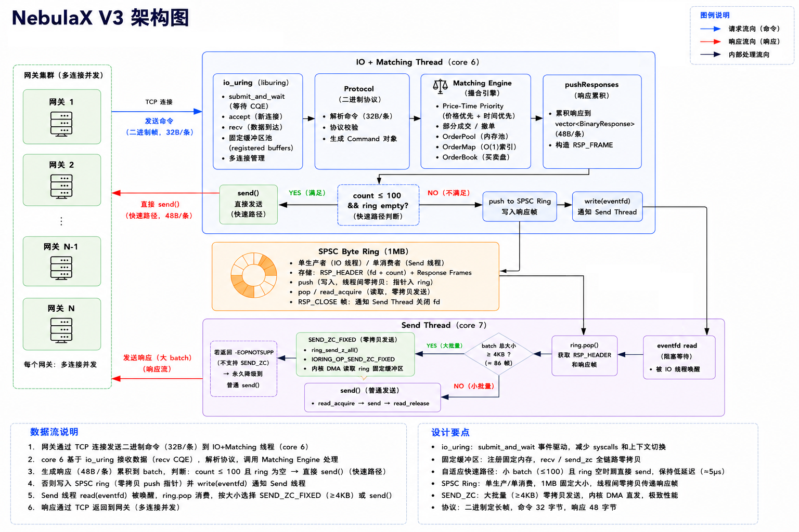

# NebulaX — Low Latency Exchange Engine

C++ 撮合引擎，持续以数据驱动的方式优化高并发低延迟。

## 架构



### Matching Engine

- Price-Time Priority（价格优先 + 时间优先 FIFO）
- 支持部分成交、撤单
- `std::map<price, list<Order>>` 买卖盘 + `unordered_map<order_id, iterator>` O(1) 撤单索引

### 协议（二进制，定长帧）

命令 32 字节，响应 48 字节。定义见 [protocol.h](include/protocol.h)。

## 当前性能

**Phase 7（当前）：** io_uring recv + SEND_ZC + 双线程 + SPSC ring，recv/send 零拷贝

| 指标 | Pipeline (50M) | Ping-pong (1M) |
|:----|:-------------:|:--------------:|
| QPS | **13.9M** | 197K |
| P50 | 40ms | 5µs |
| P99 | 51ms | 6µs |
| P999 | 56ms | 7µs |

硬件：12th Gen Intel Core i9-12900HX / 24 核 / 31GB RAM / Ubuntu 22.04 / Linux 6.8.0<br>
绑核：IO+Matching core 6、Send core 7、Client core 5（均为 P-core）<br>
网络：127.0.0.1 loopback TCP

## 项目结构

```
NebulaX/
├── include/                   # 头文件
│   ├── order.h                    订单定义
│   ├── order_book.h               买卖盘 + 索引
│   ├── order_pool.h               订单内存池（Phase 6）
│   ├── order_map.h                订单 O(1) 查找索引
│   ├── matching_engine.h          撮合引擎
│   ├── protocol.h                 二进制协议（32B 命令 / 48B 响应）
│   ├── spsc_byte_ring.h           SPSC 字节环形缓冲区（SEND_ZC 固定缓冲区）
│   ├── tcp_server.h               io_uring 服务端
│   ├── io_uring_poller.h          io_uring 封装（accept/recv + 固定缓冲区池）
├── src/                       # 实现
├── benchmark/                 # 压测客户端
│   └── benchmark_client.cpp
├── scripts/
│   └── nebulaX_bench.sh           压测 + perf 脚本
├── docs/
│   ├── BENCHMARK.md               V1 基线压测报告
│   ├── optimizations/io_uring.md       Phase 7 io_uring 性能报告
│   ├── optimizations/             各阶段优化实验记录
│   └── images/
├── profiling/                 # 火焰图等 profiling 产出
└── README.md
```

## Benchmark

```bash
sudo bash ./scripts/nebulaX_bench.sh         # pipeline 模式（默认）
sudo bash ./scripts/nebulaX_bench.sh -r      # ping-pong 模式
```

输出：QPS / 延迟分布 / perf 热点 / 火焰图 / 硬件事件（IPC cache-misses ctx/s syscall）

## 优化路线

| 阶段 | 内容 | 状态 |
|:----|------|:----:|
| V1 | 纯文本协议基线 | 已完成 |
| Phase 3 | 二进制协议 + 批量收发 | 已完成 |
| Phase 4 | epoll ET reactor + 多连接 | 已完成 |
| Phase 5 rev2 | 双线程 + SPSC byte ring + 快速路径 | 已完成 |
| Phase 6 | 内存池 + 平坦数据结构 | 已完成 |
| Phase 7 | io_uring recv + SEND_ZC，recv/send 零拷贝 | 已完成 |

## 环境

- 构建：CMake + g++11（Ubuntu 22.04）
- 压测：C++17，POSIX sockets，taskset 绑核
- 分析：perf dwarf unwind，FlameGraph
