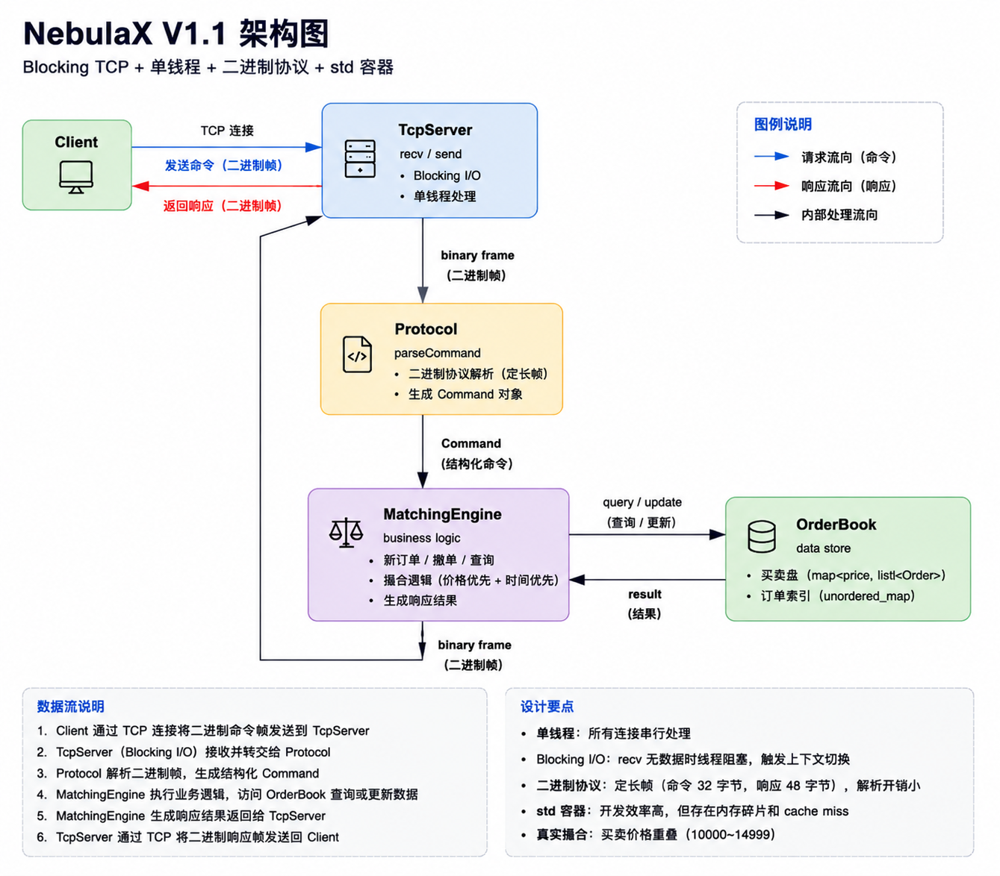

# NebulaX — Low Latency Exchange Engine

这是一个撮合系统。会一直朝着高并发低延迟的方向优化，业务逻辑简单而专一，优化手段就是不停测量各种数据，然后分析数据，推测可优化方向，就这样反复优化。

## 架构



### Matching Engine

- Price-Time Priority（价格优先 + 时间优先 FIFO）
- 支持部分成交、撤单
- `std::map<price, list<Order>>` 买卖盘 + `unordered_map<order_id, iterator>` O(1) 撤单索引
- 撮合逻辑与 OrderBook 解耦

### 协议（二进制，定长帧）

命令 32 字节，响应 48 字节。定义见 [protocol.h](include/protocol.h)。

## 当前阶段

**V1.1（当前 Phase 3 已完成）：** Blocking TCP + 单线程 + 二进制协议 + std 容器

| 指标 | Ping-pong（RTT） | Pipeline（吞吐） |
|------|:----------------:|:----------------:|
| QPS | **135K** | **1,954K** |
| 平均延迟 | 7 µs | 33 ms |
| P50 | 7 µs | 36 ms |
| P99 | 10 µs | 37 ms |
| P999 | 29 µs | 63 ms |
| IPC | 1.39 | **2.00** |
| ctx/s | 124K | 653 |
| sendto | 1,500,600 | 1,500,600 |
| recvfrom | 1,500,600 | 12,554 |

> Ping-pong 延迟维持 V1 水平（7µs P50），Pipeline 吞吐从 66 万提升到 195 万 QPS（+194%）。<br>
> 收益来自二进制协议 + 批量收发的组合效果，两者缺一不可。详见 [优化记录](docs/optimizations/binary_protocol.md)。<br>

硬件：12th Gen Intel Core i9-12900HX / 24 核 / 31GB RAM / Ubuntu 22.04<br>
绑核：服务端 core 6（P-core），客户端 core 5（P-core），taskset 隔离<br>
网络：127.0.0.1 loopback TCP


## Profiling

benchmark 脚本集成编译、压测、perf 采样、硬件事件分析、火焰图生成：

```
sudo bash ./scripts/nebulaX_bench.sh 2250       # pipeline 模式（默认）
sudo bash ./scripts/nebulaX_bench.sh 2250 -r    # ping-pong 模式
```

输出涵盖：
- 压测 QPS / 延迟分布（P50 / P99 / P999），3 轮稳态重复
- 两种模式对比（Ping-pong RTT + Pipeline 吞吐）
- perf report + 火焰图（dwarf unwind，含 kernel 侧完整调用链）
- 硬件事件：IPC、L1-dcache-misses、L2-misses、syscall 计数
- 上下文切换频率（ctx/s）
- kernel 安全检查开销分析（`__check_object_size` 等）
- 汇总行：一条命令看全关键指标

详细方法论和数据分析见 [BENCHMARK.md](docs/BENCHMARK.md)。

## 环境

- 构建：CMake + g++11（Ubuntu 22.04）
- 压测客户端：C++17，POSIX sockets
- 分析工具：perf, FlameGraph

## 项目结构

```
NebulaX/
├── include/               # 头文件
│   ├── order.h               订单定义
│   ├── order_book.h          买卖盘 + 索引
│   ├── matching_engine.h     撮合引擎
│   ├── protocol.h            二进制协议定义（32B 命令 / 48B 响应）
│   └── tcp_server.h          Blocking TCP 服务端
├── src/                   # 实现
├── benchmark/             # 压测客户端
│   └── benchmark_client.cpp
├── scripts/
│   └── nebulaX_bench.sh       压测 + perf 脚本
├── docs/
│   ├── BENCHMARK.md           # V1 基线压测报告
│   ├── optimizations/         # 各阶段优化实验记录
│   └── images/                配图
├── profiling/             # 火焰图等 profiling 产出
└── README.md
```

### 优化方向

| 优化 | 状态 | 目标 |
|------|----|------|
| 二进制协议 + 批量收发 |  已完成 | 砍掉 locale + 堆分配，Pipeline 3x QPS |
| epoll |  待开始 | 单线程管多个连接，线程分离的前提 |
| 线程分离 | 待开始 | send 阻塞不波及撮合，利用多核 |