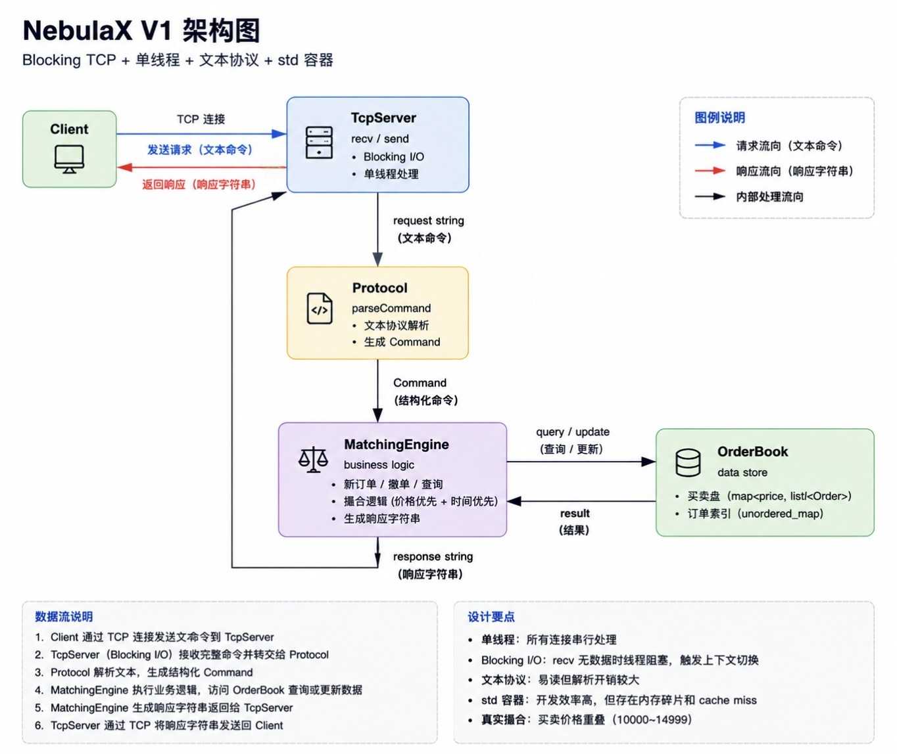
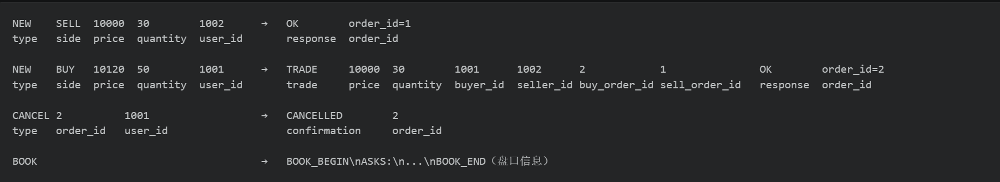

# NebulaX — Low Latency Exchange Engine

这是一个撮合系统。会一直朝着高并发低延迟的方向优化，业务逻辑简单而专一，优化手段就是不停测量各种数据，然后分析数据，推测可优化方向，就这样反复优化。

## 架构



### Matching Engine

- Price-Time Priority（价格优先 + 时间优先 FIFO）
- 支持部分成交、撤单
- `std::map<price, list<Order>>` 买卖盘 + `unordered_map<order_id, iterator>` O(1) 撤单索引
- 撮合逻辑与 OrderBook 解耦

### 协议（V1，文本）



撤单时会校验 user_id 是否匹配。

## 当前阶段

**V1：** Blocking TCP + 单线程 + 文本协议 + std 容器

| 指标 | Ping-pong（RTT） | Pipeline（吞吐） |
|------|:----------------:|:----------------:|
| QPS | 141,070 | **692,909** |
| 平均延迟 | 7 µs | 175 ms |
| P50 | 7 µs | 195 ms |
| P99 | 10 µs | 253 ms |
| P999 | 19 µs | 255 ms |
| IPC | 1.98 | **2.94** |
| ctx/s | 121,250 | **207** |
| syscall/s | ~250K | ~250K |

> 两种模式互补：Ping-pong 测单笔交互延迟（交易者视角），Pipeline 测引擎吞吐上限（gateway 视角）。<br>
> 买卖价格重叠（10000~14999），含真实撮合。每模式 3 × 500K 命令。<br>
> 内核安全检查（`__check_object_size`）占用 Ping-pong 下约 26% CPU、Pipeline 下约 10%，这是 Ubuntu 默认内核 `CONFIG_HARDENED_USERCOPY` 的开销。每次 syscall 触发一次。<br>

硬件：12th Gen Intel Core i9-12900HX / 24 核 / 31GB RAM / Ubuntu 22.04<br>
绑核：服务端 core 6（P-core），客户端 core 5（P-core），taskset 隔离<br>
网络：127.0.0.1 loopback TCP


## Profiling

benchmark 脚本集成编译、压测、perf 采样、硬件事件分析、火焰图生成：

```
sudo bash ./scripts/nebulaX_bench.sh 2250       # pipeline 模式（默认）
sudo bash ./scripts/nebulaX_bench.sh 2250 -r    # ping-pong 模式
```

输出涵盖：
- 压测 QPS / 延迟分布（P50 / P99 / P999），3 轮稳态重复
- 两种模式对比（Ping-pong RTT + Pipeline 吞吐）
- perf report + 火焰图（dwarf unwind，含 kernel 侧完整调用链）
- 硬件事件：IPC、L1-dcache-misses、L2-misses、syscall 计数
- 上下文切换频率（ctx/s）
- kernel 安全检查开销分析（`__check_object_size` 等）
- 汇总行：一条命令看全关键指标

详细方法论和数据分析见 [BENCHMARK.md](BENCHMARK.md)。

## 环境

- 构建：CMake + g++11（Ubuntu 22.04）
- 压测客户端：C++17，POSIX sockets
- 分析工具：perf, FlameGraph

## 项目结构

```
NebulaX/
├── include/               # 头文件
│   ├── order.h               订单定义
│   ├── order_book.h          买卖盘 + 索引
│   ├── matching_engine.h     撮合引擎
│   ├── protocol.h            文本协议解析
│   └── tcp_server.h          Blocking TCP 服务端
├── src/                   # 实现
├── benchmark/             # 压测客户端
│   └── benchmark_client.cpp
├── scripts/
│   └── nebulaX_bench.sh       压测 + perf 脚本
├── docs/
│   └── images/                配图（架构图等）
├── profiling/             # 火焰图等 profiling 产出
├── BENCHMARK.md           # 性能监测报告
└── README.md
```

### 优化方向

| 优化 | 目标 | 数据支撑 | 依赖 |
|------|------|---------|------|
| 二进制协议 | 砍掉 ~15% locale + ~12% 堆分配 | 火焰图自采样前两位 | 无 |
| 批量 send | sendto syscall 从 1.5M 降到几千 | Pipeline sendto 是 recvfrom 的 260 倍 | 无 |
| epoll | 单线程管多个连接，线程分离的前提 | 当前只能串行 accept | 无 |
| 线程分离 | send 阻塞不波及撮合，利用多核 | 8 核只用 1 核 | epoll |


**二进制协议**不依赖 IO 模型和线程模型，改了立即可测。**批量 send** 在 pipeline 模式下攒 buffer 再 flush，sendto 次数从 1.5M 降到几千。**epoll** 把连接上限从 1 解开，作为线程分离的底盘。**线程分离**解 send 阻塞拖累全局的问题，利用多核并行。

四项互不冲突，预计顺序：二进制协议 → 批量 send → epoll → 线程分离。